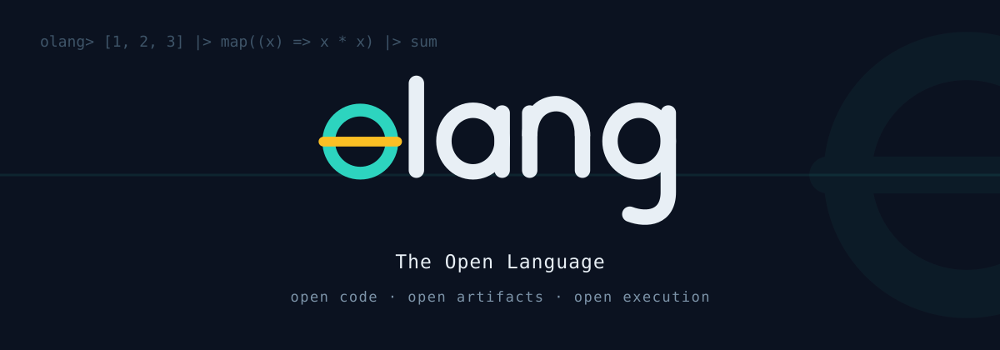

<p align="center">
  
</p>

# olang

olang is a dynamically typed, functional programming language implemented in
Rust. Its core features are first-class functions, pipeline composition,
pattern matching, algebraic data types, and immutable values. The
distribution includes a data-analysis stack (typed columns, data frames,
statistical inference, and SVG charts), thread-based parallelism without a
global interpreter lock, a source-based package manager, and a three-tier
execution model.

A distinguishing design goal is *openness*: a program's source structure, its
compiled artifacts, and its execution history are all represented as data
that olang programs can inspect.

- **Open code.** A program's abstract syntax tree is a stable, documented
  data format. The `meta.parse` function returns it as ordinary olang values,
  so linters and code-transformation tools are written as olang programs
  rather than as changes to the compiler.
- **Open artifacts.** A compiled binary embeds its own source and a checksum,
  and declares the capabilities it is permitted to use. The `olang inspect`
  command reads all of this back out.
- **Open execution.** A run can be recorded to a portable trace and replayed
  exactly, on another machine and at a later time, with `olang record` and
  `olang replay`.

These properties follow from decisions made elsewhere in the design: an
early-stabilized syntax, immutable values, and a small, explicit boundary
around side effects. The [Openness](docs/openness.md) chapter describes the
mechanisms in detail.

```olang
type Shape = enum { Circle(Float), Rect(Float, Float) }

fn area(s) = match s {
    Circle(r) => 3.14159 * r * r,
    Rect(w, h) => w * h
}

let total = [Circle(1.0), Rect(2.0, 3.0), Circle(0.5)]
    |> map(area)
    |> fold(0.0, (acc, a) => acc + a)

println(`total area: ${total}`)
```

The [olang book](docs/README.md) is the reference documentation; every code
block in it and in this file is executed by the test suite.
[Stability and compatibility](docs/stability.md) is the authoritative
statement of what is stable, evolving, and experimental.

## Installation

```bash
cargo install --path .

olang script.ol            # run a program; arguments reach os.args()
olang                      # start the REPL
olang test                 # run test blocks under the current directory
olang fmt --check .        # check formatting
olang check                # report provable type-annotation violations
olang --watch script.ol    # re-run on every save
```

The language also runs in the browser: the website's playground compiles the
interpreter, bytecode tier, and data stack to WebAssembly and runs them
sandboxed in the page (`cd website && bun run dev`, then open `/playground`).
No code leaves the browser.

## Language features

- **Expressions.** `if`, `match`, blocks, and loops evaluate to values.
  `return` and `break value` provide early exits.
- **Pattern matching.** Patterns cover literals, tuples, lists with a
  `...rest` binding, structs, enum variants, ranges, or-patterns, and guards.
- **Algebraic data types.** Enums carry payload constructors; struct
  declarations validate shape and annotated field types at construction;
  traits dispatch at runtime; `error` declarations define typed error values.
- **Gradual typing.** Unannotated code runs fully dynamically at no cost.
  Every annotation is enforced at runtime on all three tiers, and `olang
  check`, together with the language server, reports provable violations —
  including element types — before the program runs. See
  [Types and gradual typing](docs/types.md).
- **Immutability.** Values are never mutated in place. Closures capture their
  environment by value.
- **Errors as values.** Fallible operations return `Result`; `?` propagates
  errors and `try`/`catch` handles them.
- **Parallelism.** One model: threads. `spawn` runs a call on an
  operating-system thread and returns a task handle that `task.join`
  collects; `chan` streams values between tasks; `par_map`, `par_filter`,
  and `par for` distribute work across cores without a global interpreter
  lock. Tasks capture by value, so there is nothing shared to race on.
- **Modules and packages.** Programs import with `use`; libraries are
  `olang.toml` packages with lockfiles, checksums, a content-addressed cache,
  and Minimal Version Selection. See [Packages and dependencies](docs/packages.md).

## Standard library

The standard library consists of native modules implemented in Rust, the data
stack, and modules and packages written in olang and compiled into the
binary. The native modules are `str`, `col`, `math`, `json`, `toml`, `csv`,
`re`, `dates`, `time`, `random`, `crypto`, `base64`, `fs`, `os`, `http` (an
HTTP client and a keep-alive server), `db` (SQLite), `chan` (channels),
`proc` (subprocesses), `testing`, `meta` (the program-as-data interface), and
`dom` (available in the WebAssembly build). The data stack adds `ods`,
`stats`, and `plot`. The embedded olang modules are `colx` and `mathx`
(extensions to `col` and `math`), which are differential-tested against their
native counterparts, and the packages `cli`, `term`, `ui`, `viz`, and `dash`.

The full reference is [The standard library](docs/stdlib.md). The browser
build, including olang as a frontend language, has its own chapter,
[olang in the browser](docs/wasm.md).

## The data stack

`ods`, `stats`, and `plot` are part of every build, including the browser
playground, and require no import. `ods` provides typed, null-aware columns
(Series) with vectorized operators and tables (Frames) with the usual table
operations, including CSV input, `group_by`, and joins. `stats` covers
common distributions, t-tests, chi-squared tests, and ordinary least squares,
with each statistic validated against SciPy reference values. `plot` renders
standalone SVG charts.

```olang
let prices = ods.series([12.5, 8.0, 15.25, 4.0])
let taxed = prices * 1.07                        // vectorized operators
println(to_string(ods.mean(taxed)))

let x = ods.series([1.0, 2.0, 3.0, 4.0, 5.0])
let y = ods.series([2.1, 3.9, 6.2, 8.1, 9.8])
let fit = stats.lm(y, x)
println(to_string(map_get(fit, "r2") > 0.99))
```

Reductions on large columns run at parity with NumPy sequentially and roughly
2.7 times faster in parallel; a 1M-row, 20-predictor ordinary-least-squares
fit runs about 3.8 times faster than `numpy.linalg.lstsq`. The full benchmark
tables, methodology, and comparison baselines are in
[The data stack](docs/ods.md).

## Execution model

olang runs on three tiers. A tree-walking interpreter is the semantic
authority. Functions that are called frequently are promoted to a register
bytecode VM (the OVM); any function the OVM cannot compile with identical
behavior stays on the interpreter. Frequently called numeric functions are
compiled further, by a Cranelift JIT, to native machine code, with type
specialization and native-to-native calls between compiled functions. Every
guard failure in compiled code deoptimizes to the bytecode tier, which owns
error reporting. A lower tier that cannot reproduce the interpreter's result
exactly refuses to run the function rather than diverging.

The bytecode tier compiles the large majority of ordinary code; the JIT
covers integer, float, struct, list, tuple, and string operations, each by a
tested rule. Full details and measured tables are in
[Architecture and internals](docs/internals.md) and
[The execution model: OVM and JIT](docs/ovm.md).

## Examples

[`examples/`](examples/) contains complete programs. The largest is
[`demo/`](examples/demo/) (Harborline), a long-running harbor-operations
simulator that uses threaded worker crews over channels, a SQLite ledger,
tariff expression trees, an RSA-signed digest chain, and daily self-checked
invariants; [the case study](docs/demo.md) reads it as a design study for
robust olang programs. The directory also includes a task CLI, a log
analyzer, a template engine, a workflow engine, a parser combinator library,
a regular-expression engine, a JSON Schema validator, a Markdown converter,
an HTTP notes API, a Lisp interpreter written in olang, a full-stack issue
tracker whose frontend runs in the browser, and several data-analysis
programs. The self-hosted harness (`olang run_all.ol`) runs the whole set,
and CI runs it on every change.

## Maturity

olang's implementation is heavily tested: more than 950 tests across the
workspace, every documentation example executed in CI, cross-tier and JIT
agreement suites, differential tests of the standard library, and a flagship
example built specifically to soak-test the runtime over long sessions. The
language, standard library, and data stack support complete programs today —
command-line tools, data analysis, HTTP services, and browser frontends are
all demonstrated in [`examples/`](examples/).

What is young is not the engine but its surroundings. The third-party
package ecosystem is small, so programs rely chiefly on the standard
library, and the project is pre-1.0: one deliberate breaking release is
planned before the compatibility contract freezes (see the
[roadmap](docs/roadmap.md)). A project that cannot absorb that migration
should pin its olang version until 1.0. The authoritative statement of what
is stable today is [Stability and compatibility](docs/stability.md).

## License

MIT

<p align="center">
  <br>
  <sub>Ollie, the olang otter</sub>
</p>
